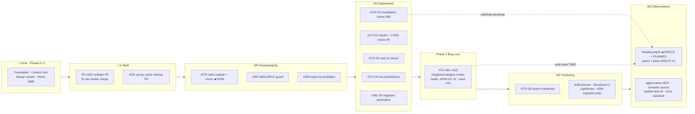

# Backlog — ticket-ready roadmap

> **How to use this file.** Each entry below is a ready-to-file GitHub issue:
> title (conventional-commit style), labels, dependencies, and a body with
> context + acceptance criteria. An agent filing these should create them with
> `gh issue create`, add them to the **Blog Build** project board, and apply
> the milestone/label noted per section. File in the listed order — later
> tickets depend on earlier ones. Existing open issues are referenced by
> number; do not duplicate them.
>
> Sequencing: **M0 (housekeeping) → M1 (deployment) → Phase 3 routes
> (existing #85–94) → M2 (hardening) → M3 (differentiators)**. Deployment
> deliberately precedes Phase 3 — every later feature needs a live URL and env
> plumbing to be testable.
>
> **Status 2026-07-12:** M0/M1 tickets are filed and on the board (numbers
> annotated per ticket below). GitHub milestones mirror these sections
> (M0 — Housekeeping, M1 — Deployment, Phase 3 — Blog core, M2 — Hardening,
> CMS restructure P4–P6; legacy Phase 0–2 milestones closed). **M0.3 (#270)
> is In Progress — the starting point.**

## Roadmap

Parked outside the flow: #13 (db layer — deferred until the engagement phase
begins).

---

## M0 — Housekeeping & board reconciliation

### M0.1 · `chore(board): reconcile Phase-3 umbrella issues with granular issues`

- **Filed:** #269
- **Labels:** `tooling`
- **Body:** #75–#78 (page-level umbrellas) overlap #85–#94 (granular
  per-component issues) — e.g. #78 duplicates #92 + #93 almost entirely, #76
  overlaps #90. Convert #75–#78 into tracking issues with task-lists that
  reference the granular issues (or close them), so Phase 3 has exactly one
  actionable ticket per unit of work. Relabel #9 and #12 into the deploy
  milestone (they are deployment blockers, not Phase-1 leftovers).
- **Acceptance:** no piece of Phase-3 work is represented by two open
  actionable issues; #9/#12 carry the `deploy` label; the board reflects the
  new structure (verify every status write stuck).

### M0.2 · `chore(repo): single canonical skills dir + guard against drift`

- **Filed:** #267
- **Labels:** `tooling`
- **Body:** `.claude/skills/` and `.agents/skills/` are duplicated and have
  drifted before (now re-synced; `.claude/skills/` is canonical, per
  `CLAUDE.md`). Add a CI step (in `ci.yml`) that fails when
  `diff -rq .claude/skills .agents/skills` is non-empty, or replace
  `.agents/skills` with symlinks if the consuming tool supports them.
- **Acceptance:** CI fails on divergence; `CLAUDE.md` documents the canonical
  copy (already done); a divergence introduced on a test branch is caught.

### M0.3 · `chore(turbo): fix stale typegen outputs + add .nvmrc`

- **Filed:** #270 (In Progress — current work item)
- **Labels:** `tooling`, `layer:config`
- **Body:** `turbo.json`'s `typegen` task declares
  `outputs: ["src/sanity.types.ts"]`, but typegen writes
  `packages/config/src/sanity/generated/{schema.json,types.ts}`. Fix the
  outputs (correct even while `cache: false`). Add `.nvmrc` with `22` so
  local, CI (`NODE_VERSION: '22'`), and Vercel agree; keep `engines` as the
  floor.
- **Acceptance:** `turbo.json` outputs match reality; `.nvmrc` present;
  `pnpm build` from root still green.

### M0.4 · `docs: keep #13 parked (db layer) — not spec drift`

- **Filed:** ✅ done — clarifying comment posted on #13 (2026-07-12); no new issue needed
- **Labels:** `documentation`
- **Body:** Correction to an earlier assumption: #13 is **not** a general
  spec-drift ticket (that drift was fixed by the SPEC rewrite PR). It tracks
  the deliberately deferred **`db` layer** (Drizzle/Neon engagement layer):
  SPEC/CLAUDE amendments, a `db` subagent, and the `drizzle-kit` allowlist
  entry, all to be done **when that phase begins, not before**. Action: leave
  #13 open, add a comment noting the SPEC rewrite landed and its checklist is
  still valid for the future db work.
- **Acceptance:** #13 remains open with the clarifying comment; no db docs
  added prematurely.

---

## M1 — Deployment milestone (label: `deploy`, all `tooling`)

### M1.1 · `chore(deploy): D0 — accounts, tokens, domains`

- **Filed:** #271
- **Depends on:** nothing (human-driven; agent prepares the checklist)
- **Body:** Prereqs for first deploy. Confirm Vercel account + GitHub repo
  connection. In manage.sanity.io: confirm `production` dataset; mint a
  **Viewer** robot token for the web app (`SANITY_API_READ_TOKEN`). Decide
  domains (`<name>.vercel.app` initially; Studio on `<name>.sanity.studio`).
  Document values in the Vercel/Sanity dashboards only — never in the repo.
- **Acceptance:** checklist complete; tokens exist; no secrets committed.

### M1.2 · `chore(deploy): D1 — deploy Sanity Studio + CORS (closes #9)`

- **Filed:** #272
- **Depends on:** M1.1
- **Body:** From `apps/cms` with `SANITY_STUDIO_PROJECT_ID`/`_DATASET` set:
  `pnpm deploy` (human runs it — agents never deploy). Then add CORS origins
  in manage.sanity.io: the Studio URL and `http://localhost:3333` (with
  credentials).
- **Acceptance:** Studio reachable at `<name>.sanity.studio`; editors can log
  in; #9 closed.

### M1.3 · `chore(deploy): D2 — web app on Vercel`

- **Filed:** #273
- **Depends on:** M1.1
- **Body:** New Vercel project: Root Directory `apps/web` (include files
  outside root), Node 22, env vars for Production + Preview
  (`NEXT_PUBLIC_SANITY_PROJECT_ID`, `NEXT_PUBLIC_SANITY_DATASET`,
  `NEXT_PUBLIC_SITE_URL`, `SANITY_API_READ_TOKEN`). Ignored Build Step:
  `npx turbo-ignore web`. First deploy = home page; this is also the first
  build with real env validation (no `SKIP_ENV_VALIDATION`). After deploy:
  add the production URL to Sanity CORS; run `npx turbo login && npx turbo
link` for remote caching.
- **Acceptance:** production URL serves the home page with Sanity content and
  images; security headers present; preview deploys build on PRs;
  turbo-ignore skips unaffected builds.

### M1.4 · `feat(web): D3 — ISR revalidation webhook (closes #93)`

- **Filed:** #274
- **Labels:** also `layer:web`
- **Depends on:** M1.3
- **Body:** `app/api/revalidate/route.ts` verifying
  `SANITY_REVALIDATE_SECRET`, calling `revalidateTag` for the service ISR
  tags. Set the secret in Vercel; create the GROQ-powered webhook in
  manage.sanity.io (publish/unpublish → POST). Seed real content under #12
  once this works end-to-end.
- **Acceptance:** publish in Studio → live page updates without redeploy;
  invalid secret → 401; unit test for the route; #93 closed.

### M1.5 · `chore(deploy): D4 — launch hardening`

- **Filed:** #275
- **Depends on:** M1.4 + Phase-3 routes (#85–94)
- **Body:** Flip `NEXT_PUBLIC_SITE_URL` to the final domain; verify
  sitemap/robots/RSS (#92) and JSON-LD (#94) against the live URL; OG-image
  check; Lighthouse pass ≥ 95; add a minimal Playwright smoke (home + one
  post render, 200s, no console errors) running against Vercel preview URLs
  in CI.
- **Acceptance:** all checks green against production; smoke job required on
  PRs.

### M1.6 · `chore(cms): D5 — automated migration deploys (extends #261)`

- **Filed:** ✅ #261 (pre-existing) — dependency comment posted 2026-07-12
- **Depends on:** M1.3 (Vercel auto-deploys now exist)
- **Body:** Implement the design in
  `docs/superpowers/specs/2026-07-10-migration-deployment-automation-design.md`:
  timestamped migrations, per-dataset applied-migrations ledger,
  `migrate:deploy`, gated post-merge workflow with backup. This is the
  existing #261 — update it with this dependency rather than filing a
  duplicate.
- **Acceptance:** per the design spec's own acceptance section.

---

## M2 — Best-practice hardening (label: `tooling`)

### M2.1 · `feat(web): draft preview — Draft Mode + Sanity Presentation`

- **Labels:** `layer:web`, `layer:service`, `enhancement`
- **Depends on:** M1.3
- **Body:** Editors currently cannot preview drafts on the real site. Wire
  Next.js `draftMode()` + Sanity Presentation (visual editing): service reads
  drafts with `SANITY_API_READ_TOKEN` when draft mode is on; Studio gets the
  Presentation tool pointing at the deployed site (preview URL per document).
- **Acceptance:** editing a draft in Studio shows it live in Presentation;
  production visitors never see drafts; token stays server-only.

### M2.2 · `chore(ci): build Storybook in CI`

- **Body:** `storybook:build` tasks exist for `packages/ui` and `apps/web` but
  no CI job runs them, so stories can rot silently. Add a non-required CI job
  running both builds.
- **Acceptance:** broken story = red job on the PR.

### M2.3 · `chore(ci): Lighthouse CI with budgets`

- **Depends on:** M1.5
- **Body:** Lighthouse CI against preview deploys for `/`, one post, one
  category page; budgets at ≥ 95 per SPEC §10. Non-required initially.
- **Acceptance:** report posted per PR; regression below budget flags.

---

## M3 — Differentiator features (label: `enhancement`)

Proposed order balances novelty × feasibility on this stack. Each needs a
`superpowers:brainstorming` session before implementation — these tickets
scope the idea, not the design.

### M3.1 · `feat: agent-native blog — llms.txt, markdown endpoints, MCP server`

- **Labels:** `layer:web`, `layer:service`
- **Body:** Make the blog a first-class citizen for AI readers, not just
  browsers — no mainstream blog does this today. Three slices, shippable
  independently: (1) `llms.txt` route describing the site for LLM crawlers;
  (2) `/blog/[slug].md` (or `?format=md`) returning clean Markdown rendered
  from Portable Text; (3) an MCP server (separate consumer of
  `@blog/service` — e.g. a route handler or small sibling app) exposing
  `search_posts` / `get_post` / `list_categories` tools so readers' agents
  (Claude, etc.) can query the corpus natively. Architecture: new consumers
  of `@blog/service` only; zero changes to `ui`; layer contracts hold.
- **Acceptance:** an MCP client can list + fetch posts; `.md` endpoints
  render valid Markdown; `llms.txt` served; documented in SPEC §1 surfaces.

### M3.2 · `feat(cms): publish-time AI generation pipeline`

- **Labels:** `layer:cms`, `layer:service`
- **Depends on:** M1.4 (webhook plumbing)
- **Body:** Generate once at publish instead of paying inference per reader:
  Sanity webhook → serverless function → Claude generates TL;DR, key
  takeaways, and related-post suggestions → written back into Sanity as
  fields on the post (drafts of generated fields are human-approvable) →
  revalidate. Zero runtime AI cost; output is fully static. Embeddings for
  related-posts double as the search index for M3.4.
- **Acceptance:** publishing a post populates summary/takeaways fields within
  a minute; human can edit/reject them; no AI calls on the reader hot path.

### M3.3 · `feat: choose-your-depth reading` — **SPEC'D + PLANNED** (flagship)

> Design: `docs/superpowers/specs/2026-07-12-reading-depth-design.md` ·
> Plan: `docs/superpowers/plans/2026-07-12-reading-depth-plan.md`.
> File the implementation issue from the spec when its prerequisites clear
> (post route #76/#90; pipeline additionally #273/#274).

- **Labels:** `layer:cms`, `layer:service`, `layer:ui`, `layer:web`
- **Depends on:** #250 (modules[] page-builder), M3.2 (generated summaries)
- **Body:** Every post renders at three depths — 30-second skim / standard /
  deep-dive — as a persistent reader control. Builds on the modules
  architecture: modules tagged with depth levels; the skim layer uses the
  publish-time TL;DR; deep-dive holds authored digressions. This is the
  flagship UX differentiator.
- **Acceptance:** depth toggle persists across posts; all three depths
  statically rendered (no client AI); brainstorm-first design doc exists.

### M3.4 · `feat: semantic search`

- **Labels:** `layer:service`, `layer:web`
- **Depends on:** M3.2 (embeddings)
- **Body:** `/search` route over the embeddings index from M3.2 — a service
  feature (`service.pages.search.v1`) + web route; genuinely better than
  keyword search on a small corpus.
- **Acceptance:** semantically-related results for non-keyword queries;
  no Sanity SDK usage outside `service`.

### M3.5 · `feat(cms): editorial voice assistant in the Studio`

- **Labels:** `layer:cms`, `enhancement`
- **Body:** Phase 1 of "my own LLM," without training anything: (1) Sanity AI
  Assist plugin with schema-aware field instructions (excerpt, OG fields, alt
  text); (2) a distilled `voice.md` profile (one-time Claude pass over all
  published posts, stored as an editorial-settings singleton, re-distilled
  every ~20 posts); (3) a "critique pass" document action — margin notes on
  weaknesses/unsupported claims/flab, powered by voice profile + top-3
  similar excerpts (RAG). Generated content always lands as Sanity drafts —
  human publishes. AI calls live in an API route/sibling package, never in
  `@blog/ui`.
- **Acceptance:** editors can generate/critique from the Studio; nothing
  auto-publishes; voice profile is editable content, not code.

### Parked (revisit after M3.1–M3.5)

- **Living posts** — periodic claim re-verification with human-approved
  changelogs.
- **Constellation home** — embeddings-clustered semantic map as the primary
  navigation.
- **Reader-lens adaptation** — authored/generated variants per audience.
- **Generative fingerprint headers** — deterministic hero art derived from
  each post's embedding.
- **Fine-tuned voice model** — only if the prompt-based voice (M3.5)
  demonstrably plateaus after 50–100 posts.
