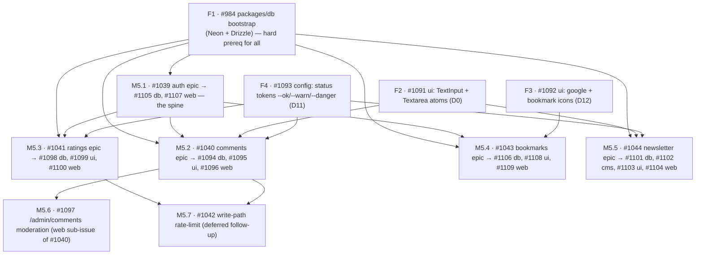

# Backlog — ticket-ready roadmap

> **How to use this file.** Each entry below is a ready-to-file GitHub issue:
> title (conventional-commit style), labels, dependencies, and a body with
> context + acceptance criteria. An agent filing these should dispatch the
> `board-keeper` subagent to create each one (`"create issue: title=...,
body=..., labels=..."` — never `gh issue create` directly, see `CLAUDE.md`),
> which creates it, adds it to the **Blog Build** project board, and applies
> the milestone/label noted per section as one verified operation. File in the
> listed order — later tickets depend on earlier ones. Existing open issues
> are referenced by number; do not duplicate them.
>
> Sequencing: **M0 (housekeeping) → M1 (deployment) → Phase 3 routes
> (existing #85–94) → M2 (hardening) → M3 (differentiators)**. Deployment
> deliberately precedes Phase 3 — every later feature needs a live URL and env
> plumbing to be testable.
>
> **Status 2026-08-01:** M0, M1, and **Phase 3 (Blog core)** are fully
> closed. **M2 (Hardening)** — #275 (D4), M2.3 (#399), M2.4 (#352) are done;
> M2.1 (draft preview) and M2.2 (Storybook CI job) are still open gaps.
> **M3 (Differentiators)** — M3.3 (choose-your-depth reading, epic #957) has
> shipped; M3.1/M3.2/M3.5 are filed and in progress; M3.4 (semantic search)
> is blocked on the `packages/db` bootstrap. GitHub milestone numbering is
> independent of this doc's M-numbers (a naming collision exists with an
> unrelated, already-closed "M3 — Post taxonomy" milestone) — this backlog's
> M3/differentiators section maps to GitHub milestone **M4 — Differentiators**;
> the engagement work all lands in **M5 — Engagement** — auth, comments, and
> ratings were already there; bookmarks (#1043) and newsletter (#1044) were
> **moved out of M6 — Enhancements into M5** (2026-08-03) so the whole phase
> shares one milestone (M6 now holds only the #1038 typegen chore). It is now
> scoped in the **M5 — Engagement layer** section below, restructured
> from the five flat feature issues (#1039–#1044) into epics + per-layer
> sub-issues per `docs/superpowers/specs/2026-08-03-engagement-ui-design.md`.

## Roadmap

```mermaid
flowchart LR
  subgraph DONE["✅ Done · Phases 0–2"]
    F[Foundation · Content core<br/>Design system · Home page]
  end
  subgraph M0["✅ M0 Housekeeping"]
    M03["#270 turbo outputs + .nvmrc"]
    M02["#267 skills-drift CI guard"]
    M01["#269 board reconciliation"]
  end
  subgraph M1["✅ M1 Deployment"]
    M11["#271 D0 accounts/tokens"]
    M12["#272 D1 Studio + CORS closes #9"]
    M13["#273 D2 web on Vercel"]
    M14["#274 D3 revalidation closes #93"]
    M16["#261 D5 migration automation"]
  end
  subgraph P3["✅ Phase 3 Blog core"]
    P3a["#75–#94, #123, #285, #327, #328<br/>blog/post/category/author/generic-page<br/>routes, feeds, JSON-LD, UI"]
  end
  subgraph M2["✅ M2 Hardening"]
    M21["#275 D4 · #399 Lighthouse CI · #352 GROQ audit"]
    M22["◀ NOW: draft preview (M2.1) · Storybook CI job (M2.2)"]
  end
  subgraph M3["M3 Differentiators (GitHub: M4)"]
    M33["✅ Reading depth — epic #957"]
    M31["#965 agent-native · #966 publish-time AI<br/>#967 voice assistant · #984/#985 search prereqs"]
  end
  subgraph M5["M5 Engagement (GitHub: M5)"]
    FND["Foundations: #984 db · D0 form atoms<br/>D11 status tokens · D12 icons"]
    AUTH["#1039 auth (spine)"]
    ENG["#1040 comments · #1041 ratings<br/>#1043 bookmarks · #1044 newsletter"]
    FND --> AUTH --> ENG
  end
  DONE --> M0 --> M1 --> P3 --> M2 --> M3 --> M5
  M14 -.->|webhook plumbing| M33
  P3a -.->|post route 76/90| M33
  M31 -.->|shared #984 bootstrap| FND
```

Parked outside the flow: none — the `db` layer (formerly #13, now #984) is no
longer parked outside the roadmap; it is now sequenced as the hard
prerequisite that opens the M5 engagement phase (see the M5 section below).
Note: #984 still carries GitHub's `deferred` label — that label reflects
"not yet started," which remains true, and is a separate, unresolved question
from its roadmap position.

---

## M0 — Housekeeping & board reconciliation — ✅ closed

### M0.1 · `chore(board): reconcile Phase-3 umbrella issues with granular issues`

- **Filed:** #269 — ✅ closed
- **Labels:** `tooling`
- **Body:** #75–#78 (page-level umbrellas) overlap #85–#94 (granular
  per-component issues) — e.g. #78 duplicates #92 + #93 almost entirely, #76
  overlaps #90. Convert #75–#78 into tracking issues with task-lists that
  reference the granular issues (or close them), so Phase 3 has exactly one
  actionable ticket per unit of work. Relabel #9 and #12 into the deploy
  milestone (they are deployment blockers, not Phase-1 leftovers).
- **Acceptance:** no piece of Phase-3 work is represented by two open
  actionable issues; #9/#12 carry the `deploy` label; the board reflects the
  new structure (verify every status write stuck).

### M0.2 · `chore(repo): single canonical skills dir + guard against drift`

- **Filed:** #267 — ✅ done (CI drift guard), then **obsolete** via #383: the
  repo is Claude-only, so `.agents/skills/`, `AGENTS.md`, `.codex/` and the
  `skills-sync` CI job were removed entirely. `.claude/skills/` is now the
  single home for skills — there is nothing left to keep in sync. Kept here as
  a record of the decision.

### M0.3 · `chore(turbo): fix stale typegen outputs + add .nvmrc`

- **Filed:** #270 — ✅ closed
- **Labels:** `tooling`, `layer:config`
- **Body:** `turbo.json`'s `typegen` task declares
  `outputs: ["src/sanity.types.ts"]`, but typegen writes
  `packages/config/src/sanity/generated/{schema.json,types.ts}`. Fix the
  outputs (correct even while `cache: false`). Add `.nvmrc` with `22` so
  local, CI (`NODE_VERSION: '22'`), and Vercel agree; keep `engines` as the
  floor.
- **Acceptance:** `turbo.json` outputs match reality; `.nvmrc` present;
  `pnpm build` from root still green.

### M0.4 · `docs: keep #13 parked (db layer) — not spec drift`

- **Filed:** ✅ done — clarifying comment posted on #13 (2026-07-12); no new issue needed
- **Labels:** `documentation`
- **Body:** Correction to an earlier assumption: #13 is **not** a general
  spec-drift ticket (that drift was fixed by the SPEC rewrite PR). It tracks
  the deliberately deferred **`db` layer** (Drizzle/Neon engagement layer):
  SPEC/CLAUDE amendments, a `db` subagent, and the `drizzle-kit` allowlist
  entry, all to be done **when that phase begins, not before**. Action: leave
  #13 open, add a comment noting the SPEC rewrite landed and its checklist is
  still valid for the future db work.
- **Acceptance:** #13 remains open with the clarifying comment; no db docs
  added prematurely.

---

## M1 — Deployment milestone (label: `deploy`, all `tooling`) — ✅ closed

### M1.1 · `chore(deploy): D0 — accounts, tokens, domains`

- **Filed:** #271 — ✅ closed
- **Depends on:** nothing (human-driven; agent prepares the checklist)
- **Body:** Prereqs for first deploy. Confirm Vercel account + GitHub repo
  connection. In manage.sanity.io: confirm `production` dataset; mint a
  **Viewer** robot token for the web app (`SANITY_API_READ_TOKEN`). Decide
  domains (`<name>.vercel.app` initially; Studio on `<name>.sanity.studio`).
  Document values in the Vercel/Sanity dashboards only — never in the repo.
- **Acceptance:** checklist complete; tokens exist; no secrets committed.

### M1.2 · `chore(deploy): D1 — deploy Sanity Studio + CORS (closes #9)`

- **Filed:** #272 — ✅ closed
- **Depends on:** M1.1
- **Body:** From `apps/cms` with `SANITY_STUDIO_PROJECT_ID`/`_DATASET` set:
  `pnpm deploy` (human runs it — agents never deploy). Then add CORS origins
  in manage.sanity.io: the Studio URL and `http://localhost:3333` (with
  credentials).
- **Acceptance:** Studio reachable at `<name>.sanity.studio`; editors can log
  in; #9 closed.

### M1.3 · `chore(deploy): D2 — web app on Vercel`

- **Filed:** #273 — ✅ closed
- **Depends on:** M1.1
- **Body:** New Vercel project: Root Directory `apps/web` (include files
  outside root), Node 22, env vars for Production + Preview
  (`NEXT_PUBLIC_SANITY_PROJECT_ID`, `NEXT_PUBLIC_SANITY_DATASET`,
  `NEXT_PUBLIC_SITE_URL`, `SANITY_API_READ_TOKEN`). Ignored Build Step:
  `npx turbo-ignore web`. First deploy = home page; this is also the first
  build with real env validation (no `SKIP_ENV_VALIDATION`). After deploy:
  add the production URL to Sanity CORS; run `npx turbo login && npx turbo
link` for remote caching.
- **Acceptance:** production URL serves the home page with Sanity content and
  images; security headers present; preview deploys build on PRs;
  turbo-ignore skips unaffected builds.

### M1.4 · `feat(web): D3 — ISR revalidation webhook (closes #93)`

- **Filed:** #274 — ✅ closed
- **Labels:** also `layer:web`
- **Depends on:** M1.3
- **Body:** `app/api/revalidate/route.ts` verifying
  `SANITY_REVALIDATE_SECRET`, calling `revalidateTag` for the service ISR
  tags. Set the secret in Vercel; create the GROQ-powered webhook in
  manage.sanity.io (publish/unpublish → POST). Seed real content under #12
  once this works end-to-end.
- **Acceptance:** publish in Studio → live page updates without redeploy;
  invalid secret → 401; unit test for the route; #93 closed.

### M1.5 · `chore(deploy): D4 — launch hardening`

- **Filed:** #275
- **Depends on:** M1.4 + Phase-3 routes (#85–94)
- **Body:** Flip `NEXT_PUBLIC_SITE_URL` to the final domain; verify
  sitemap/robots/RSS (#92) and JSON-LD (#94) against the live URL; OG-image
  check; Lighthouse pass ≥ 95; add a minimal Playwright smoke (home + one
  post render, 200s, no console errors) running against Vercel preview URLs
  in CI.
- **Acceptance:** all checks green against production; smoke job required on
  PRs.

### M1.6 · `chore(cms): D5 — automated migration deploys (extends #261)`

- **Filed:** ✅ #261 (pre-existing) — dependency comment posted 2026-07-12
- **Depends on:** M1.3 (Vercel auto-deploys now exist)
- **Body:** Implement the design in
  `docs/superpowers/specs/2026-07-10-migration-deployment-automation-design.md`:
  timestamped migrations, per-dataset applied-migrations ledger,
  `migrate:deploy`, gated post-merge workflow with backup. This is the
  existing #261 — update it with this dependency rather than filing a
  duplicate.
- **Acceptance:** per the design spec's own acceptance section.

---

## M2 — Best-practice hardening (label: `tooling`)

### M2.1 · `feat(web): draft preview — Draft Mode + Sanity Presentation`

- **Labels:** `layer:web`, `layer:service`, `enhancement`
- **Depends on:** M1.3
- **Body:** Editors currently cannot preview drafts on the real site. Wire
  Next.js `draftMode()` + Sanity Presentation (visual editing): service reads
  drafts with `SANITY_API_READ_TOKEN` when draft mode is on; Studio gets the
  Presentation tool pointing at the deployed site (preview URL per document).
- **Acceptance:** editing a draft in Studio shows it live in Presentation;
  production visitors never see drafts; token stays server-only.

### M2.2 · `chore(ci): build Storybook in CI`

- **Body:** `storybook:build` tasks exist for `packages/ui` and `apps/web` but
  no CI job runs them, so stories can rot silently. Add a non-required CI job
  running both builds.
- **Acceptance:** broken story = red job on the PR.

### M2.3 · `chore(ci): Lighthouse CI with budgets`

- **Filed:** #399 — ✅ closed
- **Depends on:** M1.5
- **Body:** Lighthouse CI against preview deploys for `/`, one post, one
  category page; budgets at ≥ 95 per SPEC §10. Non-required initially.
- **Acceptance:** report posted per PR; regression below budget flags.

### M2.4 · `perf(service): audit all GROQ queries for round-trips + projection efficiency`

- **Filed:** #352 — ✅ closed
- **Labels:** `layer:service`, `enhancement`
- **Depends on:** Phase 3 routes landed (the audit is most useful once every
  query slice exists) — soft dependency, can start earlier.
- **Body:** As the per-feature `adaptor/**/query.ts` slices have accumulated,
  no pass has looked at them holistically for efficiency. The blog-index work
  surfaced concrete patterns worth a systematic sweep: sequential fetches that
  could be a single round-trip (or genuinely can't — e.g. the `index-page`
  read-then-slice on `page_blog.itemsPerPage`, which is inherent and should be
  left as-is), over-fetching (projecting fields the transformer never reads),
  correct `.notNull()`/`.nullable(true)` on every branch, and consistent
  ISR/`isr(...)` cache tags. Review **every** query slice under
  `packages/service/src/features/**/adaptor/**/query.ts` (plus shared
  fragments in `shared/fragments/`) against: (1) round-trips — can independent
  reads combine, and are sequential reads truly dependent; (2) projection
  scope — drop unused fields, prefer fragments; (3) nullability correctness;
  (4) slice/pagination bounds; (5) ISR tag correctness. Apply the clear wins in
  the same PR; split anything large into its own follow-up ticket.
- **Acceptance:** every query slice reviewed with findings noted; unambiguous
  optimisations applied; larger refactors ticketed; `pnpm --filter @blog/service
test` + `type-check` green; no behavioural regressions.

---

## M3 — Differentiator features (label: `enhancement`)

Proposed order balances novelty × feasibility on this stack. Each needs a
`superpowers:brainstorming` session before implementation — these tickets
scope the idea, not the design.

### M3.1 · `feat: agent-native blog — llms.txt, markdown endpoints, MCP server`

- **Labels:** `layer:web`, `layer:service`
- **Body:** Make the blog a first-class citizen for AI readers, not just
  browsers — no mainstream blog does this today. Three slices, shippable
  independently: (1) `llms.txt` route describing the site for LLM crawlers;
  (2) `/blog/[slug].md` (or `?format=md`) returning clean Markdown rendered
  from Portable Text; (3) an MCP server (separate consumer of
  `@blog/service` — e.g. a route handler or small sibling app) exposing
  `search_posts` / `get_post` / `list_categories` tools so readers' agents
  (Claude, etc.) can query the corpus natively. Architecture: new consumers
  of `@blog/service` only; zero changes to `ui`; layer contracts hold.
- **Acceptance:** an MCP client can list + fetch posts; `.md` endpoints
  render valid Markdown; `llms.txt` served; documented in SPEC §1 surfaces.

### M3.2 · `feat(cms): publish-time AI generation pipeline` — ✅ **superseded, closed**

- **Filed:** #966 — closed 2026-08-01, superseded. Its core scope (Claude
  generates TL;DR/takeaways, writes back to Sanity as a draft, publish-time
  only) shipped as part of M3.3's epic #957 (#958–962). The remaining piece
  — related-post suggestions via embeddings — is now tracked under M3.4's
  semantic search epic #1045 instead of here.
- **Labels:** `layer:cms`, `layer:service`
- **Depends on:** M1.4 (webhook plumbing)
- **Body (historical):** Generate once at publish instead of paying
  inference per reader: Sanity webhook → serverless function → Claude
  generates TL;DR, key takeaways, and related-post suggestions → written
  back into Sanity as fields on the post (drafts of generated fields are
  human-approvable) → revalidate. Zero runtime AI cost; output is fully
  static. Embeddings for related-posts double as the search index for M3.4.
- **Acceptance:** publishing a post populates summary/takeaways fields within
  a minute; human can edit/reject them; no AI calls on the reader hot path.

### M3.3 · `feat: choose-your-depth reading` — ✅ **shipped**

- **Filed:** epic #957 → #958 (config) · #959 (cms) · #960 (service) ·
  #961 (ui) · #962 (web) — all closed 2026-08-01.

> Design: `docs/superpowers/specs/2026-07-12-reading-depth-design.md` ·
> Plan: `docs/superpowers/plans/2026-07-12-reading-depth-plan.md`.

- **Labels:** `layer:cms`, `layer:service`, `layer:ui`, `layer:web`
- **Depends on:** #250 (modules[] page-builder), M3.2 (generated summaries)
- **Body:** Every post renders at three depths — 30-second skim / standard /
  deep-dive — as a persistent reader control. Builds on the modules
  architecture: modules tagged with depth levels; the skim layer uses the
  publish-time TL;DR; deep-dive holds authored digressions. This is the
  flagship UX differentiator.
- **Acceptance:** depth toggle persists across posts; all three depths
  statically rendered (no client AI); brainstorm-first design doc exists.

### M3.4 · `feat: semantic search`

- **Labels:** `layer:service`, `layer:web`
- **Depends on:** M3.2 (embeddings)
- **Body:** `/search` route over the embeddings index from M3.2 — a service
  feature (`service.pages.search.v1`) + web route; genuinely better than
  keyword search on a small corpus.
- **Acceptance:** semantically-related results for non-keyword queries;
  no Sanity SDK usage outside `service`.

### M3.5 · `feat(cms): editorial voice assistant in the Studio`

- **Labels:** `layer:cms`, `enhancement`
- **Body:** Phase 1 of "my own LLM," without training anything: (1) Sanity AI
  Assist plugin with schema-aware field instructions (excerpt, OG fields, alt
  text); (2) a distilled `voice.md` profile (one-time Claude pass over all
  published posts, stored as an editorial-settings singleton, re-distilled
  every ~20 posts); (3) a "critique pass" document action — margin notes on
  weaknesses/unsupported claims/flab, powered by voice profile + top-3
  similar excerpts (RAG). Generated content always lands as Sanity drafts —
  human publishes. AI calls live in an API route/sibling package, never in
  `@blog/ui`.
- **Acceptance:** editors can generate/critique from the Studio; nothing
  auto-publishes; voice profile is editable content, not code.

### Parked (revisit after M3.1–M3.5)

- **Living posts** — periodic claim re-verification with human-approved
  changelogs.
- **Constellation home** — embeddings-clustered semantic map as the primary
  navigation.
- **Reader-lens adaptation** — authored/generated variants per audience.
- **Generative fingerprint headers** — deterministic hero art derived from
  each post's embedding.
- **Fine-tuned voice model** — only if the prompt-based voice (M3.5)
  demonstrably plateaus after 50–100 posts.

---

## M5 — Engagement layer (GitHub: `M5 — Engagement`)

> **Design source of truth (both required reading before filing/building):**
> `docs/superpowers/specs/2026-08-03-engagement-ui-design.md` (UX — placement,
> states, component boundaries, prop surfaces, decision log D0–D10) and
> `docs/superpowers/specs/2026-08-03-engagement-visual-tokens-spec.md` (visual —
> the console/terminal token map, D11 status tokens, D12 icons). The mock
> `docs/design-reference/engagement-ui-mock.html` demonstrates the target look;
> `docs/design-reference/google.svg` is the sanctioned 4-colour provider mark.
> Per-epic `superpowers:writing-plans` passes come **after** this ticketing.

**Restructuring — done.** Five features were originally filed as **flat,
multi-layer issues** (#1039–#1044), which violated this repo's "a feature
spanning 2+ layers gets an epic + one sub-issue per layer" rule. Each existing
issue was reused **as its epic** (like reading-depth's #957) and the per-layer
sub-issues below (#1091–#1109) were filed underneath it — no existing issue
was duplicated; the flat issue became the parent. Filed 2026-08-03 via
`board-keeper`.

**One milestone for the whole phase.** The five features are one coherent phase
behind a shared spine (auth) and shared foundations. Auth (#1039), comments
(#1040), ratings (#1041), and the #1042 rate-limit were already in **M5 —
Engagement**; bookmarks (#1043) and newsletter (#1044) were **moved from M6 —
Enhancements into M5** (decided 2026-08-03) so the whole dependency graph lives
in one milestone. Every new sub-issue below is filed into **M5 — Engagement**.
The `#984` db bootstrap is the one exception — it stays in `M4 —
Differentiators` because it is also the semantic-search prereq (see F1).

### Sequencing (hard order — later depends on earlier)

```mermaid
flowchart TD
  DB["F1 · #984 packages/db bootstrap<br/>(Neon + Drizzle) — hard prereq for all"]
  F2["F2 · #1091 ui: TextInput + Textarea atoms (D0)"]
  F3["F3 · #1092 ui: google + bookmark icons (D12)"]
  F4["F4 · #1093 config: status tokens --ok/--warn/--danger (D11)"]
  AUTH["M5.1 · #1039 auth epic → #1105 db, #1107 web — the spine"]
  CMT["M5.2 · #1040 comments epic → #1094 db, #1095 ui, #1096 web"]
  RAT["M5.3 · #1041 ratings epic → #1098 db, #1099 ui, #1100 web"]
  BMK["M5.4 · #1043 bookmarks epic → #1106 db, #1108 ui, #1109 web"]
  NWS["M5.5 · #1044 newsletter epic → #1101 db, #1102 cms, #1103 ui, #1104 web"]
  MOD["M5.6 · #1097 /admin/comments moderation (web sub-issue of #1040)"]
  RL["M5.7 · #1042 write-path rate-limit (deferred follow-up)"]

  DB --> AUTH
  F4 --> CMT & RAT & NWS
  F2 --> CMT & NWS
  F3 --> BMK
  AUTH --> CMT & RAT & BMK
  DB --> CMT & RAT & BMK & NWS
  CMT --> MOD
  CMT --> RL
  RAT --> RL
```

Build order (all issues below are now filed — this is the order to _work_
them, on the board's Todo → In Progress transition, not a filing order):
**F1 (#984) → (F2 #1091, F3 #1092, F4 #1093 in parallel) → M5.1 auth (#1105,
#1107) → (M5.2 #1094–#1096, M5.3 #1098–#1100, M5.4 #1106/#1108/#1109 in
parallel) → M5.5 newsletter #1101–#1104 (independent of auth) → M5.6
moderation #1097 → M5.7 rate-limit #1042.** F2/F3/F4/M5.5 do **not** need
auth; they can proceed alongside the auth spine to shorten the critical path.

### Foundations (build once — gate the feature epics)

#### F1 · `chore(db): scaffold packages/db (Neon Postgres + Drizzle)` — **#984 (exists)**

- **Milestone / labels:** GitHub `M4 — Differentiators` · `tooling`, `deferred`,
  `layer:db`. **Left in M4 on purpose** — it is the shared bootstrap for both
  semantic search (M3.4/#1046) and this whole engagement phase; it is not
  re-milestoned, only referenced here as the hard prereq.
- **Depends on:** nothing. **Hard prerequisite for every M5 epic below.**
- **Body:** the non-Sanity persistence layer — a single Neon Postgres accessed
  via `@blog/db` (Drizzle), same "one DB, same contract as `service`" strategy
  as `2026-07-31-semantic-search-design.md`. `service` stays Sanity-only; `db`
  is a sibling data layer that `web` consumes. Feature tables are added by each
  epic's own `db` sub-issue — this ticket only stands the package up (client,
  schema/migration tooling, env wiring, pgvector for search). **Migration
  mechanism is part of this scaffold, not an afterthought:** wire
  `drizzle-kit generate` (produces the reviewable SQL diff — this step is the
  dry-run, since generate never touches the database) and `drizzle-kit
migrate`, wrapped as `db:generate`/`db:migrate` package scripts; wire the
  CI `migrate` job's db equivalent (backup the shared/production Neon branch
  → apply, gated behind the same release-tag trigger Sanity content
  migrations use — see `docs/DEPLOY.md`'s `verify → migrate → deploy` chain)
  so a later feature's schema change has somewhere real to land. Full
  workflow and the open rollback-strategy decision: `.claude/agents/db.md`'s
  "Migrations" section.
- **Acceptance:** `@blog/db` builds, migrates against Neon, is aliased into
  `web`'s tsconfig+vitest; `db:generate`/`db:migrate` scripts exist and are
  documented; no feature tables yet (those land per-epic).

#### F2 · `feat(ui): TextInput + Textarea form atoms` — **#1091 (filed)**

- **Milestone / labels:** `M5 — Engagement` · `enhancement`, `layer:ui`.
- **Depends on:** F4 (the `invalid` variant binds the `--danger` token).
- **Body:** `@blog/ui` has **no** field primitives today. Add two pure,
  controlled atoms both the comment form (#1040) and newsletter form (#1044)
  build on: `atoms/text-input` and `atoms/textarea` — `value`/`onChange`,
  required `ariaLabel`, an `invalid` `tv` variant switching the border to
  `--danger`, the global `:focus-visible` ring, an optional leading `$`/`›`
  prompt slot (console idiom). `Textarea` adds `rows`/`maxLength`. Prop
  surfaces are fixed in the UX doc §"Form-input primitives"; tokens in the
  visual spec §3.4. Stories + tests per `ui-storybook` / `testing-practices`.
- **Acceptance:** both atoms render controlled, expose the `invalid` state, ship
  stories + co-located tests; no `'use client'`; no hardcoded colours.

#### F3 · `feat(ui): google + bookmark icon assets` — **#1092 (filed)**

- **Milestone / labels:** `M5 — Engagement` · `enhancement`, `layer:ui`.
- **Depends on:** nothing.
- **Body:** add two SVGs under `packages/ui/src/assets/icons/`: **`google.svg`**
  — the official 4-colour mark (the _one_ sanctioned non-`currentColor`
  exception, for the sign-in provider button; source in the visual spec §8.1 /
  `docs/design-reference/google.svg`) — and **`bookmark.svg`** — monochrome
  `currentColor` per the set convention, one path whose filled/outline swap is
  driven by `aria-pressed` in the component (visual spec §8.2). Wire both into
  the icon registry the way the existing `github`/`share`/`copy` glyphs are.
- **Acceptance:** both icons resolve through `Icon`; `google` keeps its 4
  colours, `bookmark` inherits `currentColor`.

#### F4 · `feat(config): status colour tokens (--ok / --warn / --danger + *-muted)` — **#1093 (filed)**

- **Milestone / labels:** `M5 — Engagement` · `enhancement`, `tooling`,
  `layer:config`.
- **Depends on:** nothing. **Gates the `ui` work of #1040, #1041, #1044** —
  until it lands, pending/success/danger states have no token to bind to.
- **Body:** `configs/tailwind/theme.css` is a single accent ramp + neutrals with
  **no** semantic status colours. Add a small set — `--ok` (success),
  `--warn` (pending/awaiting), `--danger` (delete/sign-out/invalid) plus
  `*-muted` tints — in `:root` and `.dark`, following the file's existing OKLCH
  - WCAG-annotation convention (visual spec §7 gives indicative values). The
    `config` sub-agent must **recompute each against `--bg`/`--surface` for WCAG
    1.4.3 text (4.5:1) and 1.4.11 non-text (3:1)** before use. **No inline
    `color-mix()` in components** — the mock's tints become the `*-muted` tokens
    so theming stays centralized. Verify the `.indigo` variant inherits cleanly.
- **Acceptance:** six tokens exist in both themes, each with a verified-contrast
  comment; the mock's placeholder `--ok/--warn/--danger` resolve to real tokens.

### M5.1 · Auth — the spine — epic **#1039**

- **Milestone / labels:** GitHub `M5 — Engagement` · epic carries
  `enhancement`; sub-issues add `layer:db` / `layer:web`.
- **Depends on:** F1 (db). **Gates the write paths of M5.2/M5.3/M5.4.**
- **Design:** UX doc "Feature 1" (D1 — header `PopoverMenu`, not a route/modal);
  visual spec §4.1. Needs the `google` icon (F3) but **no new `@blog/ui`
  component** — composes existing `Avatar` / `PopoverMenu` / `Button`.
- **Sub-issues (parent #1039):**
  - **db** · **#1105** `feat(db): Auth.js adapter tables` — users / accounts /
    sessions / verification_tokens in `@blog/db` per the Auth.js Drizzle adapter.
  - **web** · **#1107** `feat(web): Auth.js (GitHub + Google) + AuthMenu island` —
    provider config + session; the `AuthMenu` client island (logged-out
    sign-in popover → `signIn(provider)`; logged-in `Avatar` dropdown with
    name/email, "My bookmarks" → `/bookmarks`, "Sign out"); wired into the
    header trailing-actions cluster beside `ThemeToggleButton` via the existing
    `actions` prop; loading placeholder mirrors `ThemeToggle`'s `mounted=false`
    (no auth-state flash); OAuth `?error=` inline notice.
- **Acceptance:** sign-in/out round-trips both providers back to the same
  article; session resolves without a logged-out→in flash; no new `ui` atom.

### M5.2 · Threaded comments — epic **#1040**

- **Milestone / labels:** GitHub `M5 — Engagement` · sub-issues add
  `layer:db` / `layer:ui` / `layer:web`.
- **Depends on:** F1, F2 (Textarea), F4 (status tokens), **M5.1 auth** (gates
  post/reply/delete).
- **Design:** UX doc "Feature 2" (D2 one reply level; D3 delete-only soft-delete
  tombstone; pending-by-default) + "Comments moderation" (D10); visual spec §4.3.
- **Sub-issues (parent #1040):**
  - **db** · **#1094** `feat(db): comments table` — id, postId, userId, nullable
    parentId, body (plain text), `status` (`pending`/`approved`/`spam`),
    timestamps, soft-delete flag. Insert path designed to accept an automatic
    pre-filter later (D10) with **no** schema change.
  - **ui** · **#1095** `feat(ui): comments components` — `CommentItem` +
    `CommentList` + `CommentForm` molecules and the `CommentsSection` organism
    (mirrors `PostsSection`: real `<h2 id={titleId}>`, `aria-labelledby`, empty
    state). Prop surfaces fixed in UX doc §"Feature 2". `CommentItem` carries
    the `actions` slot so the public thread and the `/admin` queue render
    identically. Pre-formatted date prop, `linkAs`, pending/tombstone tokens.
  - **web** · **#1096** `feat(web): CommentThread island + POST /api/comments`
    — the stateful island mounted after `Article.Footer`, before Related
    reading; pending-by-default insert; author sees their own pending comment
    optimistically ("Pending review" badge); the public list excludes other
    users' pending rows; logged-out → the Feature-1 sign-in prompt.
  - **web** · **#1097** `feat(web): /admin/comments moderation queue` — see
    M5.6 below (filed as this epic's fourth sub-issue, not a separate epic).
- **Acceptance:** a comment posts as `pending`, invisible to the public but
  shown to its author; one visual reply level; author can soft-delete to a
  tombstone; section is a labeled lazy island; article stays static.

### M5.3 · Post ratings — epic **#1041**

- **Milestone / labels:** GitHub `M5 — Engagement` · sub-issues add
  `layer:db` / `layer:ui` / `layer:web`.
- **Depends on:** F1, F4 (the "✓ saved" success token), **M5.1 auth** (gates
  the input).
- **Design:** UX doc "Feature 3" (D4 five stars in the console/terminal idiom;
  D5 end-of-article, above comments; upsert on `(userId, postId)`); visual spec
  §4.2 (ASCII gauge, `--accent` filled / `--border-strong` empty, numeral
  carries precision).
- **Sub-issues (parent #1041):**
  - **db** · **#1098** `feat(db): ratings table + aggregate` — composite-unique
    `(userId, postId)`, value 1–5; a summary query (avg + count) the write path
    returns for optimistic recompute.
  - **ui** · **#1099** `feat(ui): RatingSummary + RatingInput atoms` —
    read-only aggregate gauge and the interactive discrete 1–5 input (hover
    fills left-to-right; roving-`tabIndex` keyboard reusing `SegmentedControl`'s
    a11y; glyphs `aria-hidden`, name via `ariaLabel`; ≥44px touch targets).
  - **web** · **#1100** `feat(web): RatingBlock island + rating upsert route` —
    owns the fetched summary + session; optimistic vote → locks glyphs,
    recomputes from the write's returned summary; aggregate cached by tag +
    `revalidateTag`; logged-out shows summary + "Sign in to rate"; rolls back
    on error.
- **Acceptance:** everyone sees the aggregate; a logged-in user rates once and
  can change it (never double); optimistic update with rollback; one compact
  row at the article foot.

### M5.4 · Bookmarks — epic **#1043**

- **Milestone / labels:** GitHub `M5 — Engagement` (moved from M6 — see the
  milestone note above) · sub-issues add `layer:db` / `layer:ui` / `layer:web`.
- **Depends on:** F1, F3 (bookmark icon), **M5.1 auth** (gates the toggle).
- **Design:** UX doc "Feature 4" (D6 **bookmarks only**, not likes — ratings
  already carry public appreciation; bookmarks are private save-for-later);
  visual spec §4.4.
- **Sub-issues (parent #1043):**
  - **db** · **#1106** `feat(db): bookmarks table` — `(userId, postId)`.
  - **ui** · **#1108** `feat(ui): BookmarkToggle atom` —
    `isBookmarked`/`onToggle`, `aria-pressed`, required `ariaLabel`;
    filled/outline via the F3 icon; active tint `--accent-muted`.
  - **web** · **#1109** `feat(web): BookmarkButton island + /bookmarks page` —
    button in the `Article.Header` meta strip beside share (save-early),
    optimistic toggle with rollback; the auth-gated `/bookmarks` route reuses
    `PostsSection` + `PostCard` (no new page primitive), reached from the
    user-menu "My bookmarks".
- **Acceptance:** logged-in toggle persists (optimistic + rollback); logged-out
  shows a sign-in affordance; `/bookmarks` lists saved posts and empty-states.

### M5.5 · Newsletter signup — epic **#1044**

- **Milestone / labels:** GitHub `M5 — Engagement` (moved from M6 — see the
  milestone note above) · sub-issues add `layer:db` / `layer:cms` /
  `layer:ui` / `layer:web`. **Independent of auth.**
- **Depends on:** F1, F2 (TextInput), F4 (status tokens). Layer order with cms:
  `cms → typegen → ui → web`.
- **Design:** UX doc "Feature 5" (D7 three surfaces: footer + CMS module +
  end-of-article; D8 `compact` strip at article end; D9 double opt-in); visual
  spec §4.5.
- **Sub-issues (parent #1044):**
  - **db** · **#1101** `feat(db): subscribers table` — email, `status`
    (`pending`/`active`), confirmation token; double opt-in.
  - **cms** · **#1102** `feat(cms): newsletter page-builder module` — a
    `module_*` document type so editors can place the signup in the page
    builder; run `pnpm typegen` and commit the regenerated `@blog/config` types.
  - **ui** · **#1103** `feat(ui): NewsletterSignup organism` — controlled,
    built on the F2 `TextInput`, with `full` (footer + CMS module — tinted
    box) and `compact` (article-end `$ subscribe` strip) variants;
    idle/submitting/success/error states bound to F4 tokens.
  - **web** · **#1104** `feat(web): NewsletterForm island + Resend double
opt-in` — the stateful form; footer placement (`full`), article-end
    (`compact`), CMS module renderer in the existing `content-module` organism;
    Resend server action sends the confirmation email; a confirm route flips
    `pending → active`; success copy "check your inbox."
- **Acceptance:** signup appears in all three surfaces; submit sends a
  confirmation email and the subscriber activates only on click; client-side
  email-format + already-subscribed + server errors surface inline.

### M5.6 · Comments moderation queue — **#1097, web sub-issue of #1040**

- **Milestone / labels:** GitHub `M5 — Engagement` · `layer:web`, child of
  #1040 (not a separate epic — it is the fourth sub-issue of the comments epic).
- **Depends on:** M5.2 (the comments `db` table + `CommentItem` `actions` slot).
- **Design:** UX doc "Comments moderation" (D10) — a **role-gated
  `/admin/comments`** route in `web` (comments live in Neon, not Sanity, so
  moderation belongs where `db` access is; a Studio tool would break the "cms =
  Sanity only" boundary). Lists `status = 'pending'` rows; **approve /
  mark-spam / delete** via server actions; **reuses the pure `CommentItem`**
  (its `actions` slot) so queue and public thread render identically. Designed
  to accept the automatic Perspective/Akismet pre-filter later with no UI change.
- **Acceptance:** only a role-gated user reaches `/admin/comments`; the three
  actions mutate status; the queue and public thread share `CommentItem`.

### M5.7 · Write-path rate limiting — **#1042 (exists, deferred)**

- **Milestone / labels:** GitHub `M5 — Engagement` · `enhancement`,
  `layer:web`, `deferred`.
- **Depends on:** M5.2 and M5.3 (the endpoints it protects must exist first).
- **Body:** Upstash Redis rate-limit on the comment/rating write endpoints
  (per-user + per-IP) so the auth-gated write paths can't be hammered. A
  follow-up hardening pass, not part of any feature's v1 acceptance.
- **Acceptance:** repeated writes past the threshold are throttled with a clear
  error; reads are unaffected.

### Non-goals (from the design docs — recorded so epics don't sprawl)

Public author profiles; comment reactions/voting/rich-text/@mentions; comment
**edit** (D3); **likes** or any appreciation count beyond the rating aggregate
(D6); building the **automatic** moderation classifier (queue is v1, D10);
newsletter **campaign composition/sending** UI (signup only); email
**notifications** for any feature. The `packages/db` schema/migrations
themselves are owned by #984 + each epic's own `db` sub-issue — the design docs
consume those shapes, they don't design them.
